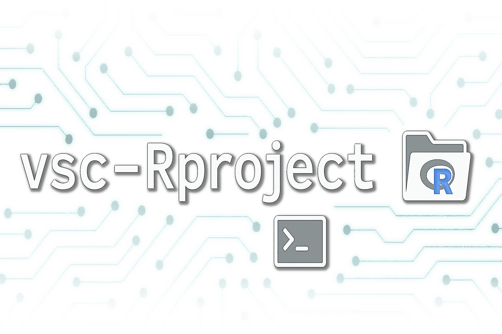

# vsc-Rproject

vsc-Rproject is a command-line tool that facilitates the creation and use of
RStudio Project-based R environments on top of the existing module system.

## Setup

Clone the repository to your `$VSC_DATA` directory. 

```bash
git clone git@github.com:hpcleuven/vsc-Rproject.git $VSC_DATA
cd $VSC_DATA/vsc-Rproject
```

Next, you can install this tool locally in your $VSC_DATA directory, using the `setup.sh` script. 
Running this script:
 - places the `load.sh` and `unload.sh` scripts in `$VSC_DATA/.local/apps/vsc-Rproject/1.0/`.
 - places the `module_file/vsc-Rproject/1.0.lua` module file in `$VSC_DATA/.local/modules/vsc-Rproject/`

```bash
bash setup.sh
```

After the setup is complete, you will still need to extend your module path.

```bash
export MODULEPATH="${VSC_DATA}/.local/modules:${MODULEPATH}"`
```

Optionally run the following commands to extend your module path from your bashrc file.

```bash
echo 'export MODULEPATH="${VSC_DATA}/.local/modules:${MODULEPATH}"' >> ~/.bashrc
source ~/.bashrc
```

## Testing vsc-Rproject

After installing vsc-Rproject with `setup.sh` you run the `test_vsc_rproject.sh` script:

```bash
cd testing
bash test_vsc_rproject.sh
```

You can always extend this script by adding your own test cases. 

## Using vsc-Rproject

Load the `vsc-Rproject/1.0` module

```bash
module load vsc-Rproject/1.0
```
Now you can call `vsc_rproject` and use the subcommands: `create`, `activate`, `deactivate` and `configure`.

e.g.
```bash
vsc_rproject --help
vsc_rproject create --help
vsc_rproject create --modules="modules.txt" --activate
```
